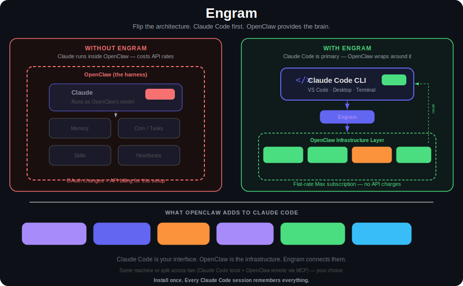

# FlipClaw

**Persistent memory, auto-generated skills, and scheduled automation for Claude Code CLI — powered by OpenClaw.**

> Your Claude Max subscription gives you Claude Code CLI. FlipClaw gives it a brain that persists across sessions, learns from every conversation, and runs tasks while you sleep.

<p align="center">
  <a href="https://raw.githubusercontent.com/bbesner/flipclaw/main/docs/hero.svg">
    
  </a>
</p>

> *Click the diagram to view full size*

---

> ### ⚡ Install in one command
> Let Claude Code (or your existing OpenClaw agent) do the entire setup for you. The AI bootstrap detects your environment, asks a few questions, and handles the rest.
>
> ```
> claude "Install FlipClaw. Read and follow the instructions at: https://raw.githubusercontent.com/bbesner/flipclaw/main/BOOTSTRAP.md"
> ```
>
> Don't have Claude Code yet? Jump to [Install](#install) for the 3-step bootstrap, or see [Manual install](#manual-install-advanced) if you'd rather do it yourself.

---

## The Problem

If you're running Claude through a third-party harness like OpenClaw, Anthropic's recent OAuth changes mean those conversations now cost API rates or extra usage billing. Your flat-rate Max subscription no longer covers it.

But **Claude Code CLI still works on Max.** It's not just the best coding AI — it's the best agentic AI interface available, period. VS Code, Claude Code Desktop, or the terminal. Included in your subscription, no API metering.

The catch? Claude Code has no memory. Every session starts from zero — no recall of your infrastructure, no awareness of decisions you've already made, and no automations.

## The Solution: Turn the Tables

Instead of putting Claude Code inside OpenClaw as its model, FlipClaw flips it — **Claude Code is now the primary interface, and OpenClaw wraps around it** to provide the persistent infrastructure.

FlipClaw flips the architecture. **Claude Code CLI is now the primary interface.** OpenClaw wraps around it to provide persistent memory, scheduled automation, heartbeats, and 24/7 capabilities — but you're working fully inside Claude Code. VS Code, Claude Code Desktop, CLI terminal — wherever you prefer.

**This is Claude Code first.** OpenClaw isn't the harness running Claude anymore. It's the infrastructure layer that gives Claude Code superpowers it doesn't have natively. Your conversations, your coding, your daily work — all happening in Claude Code on your Max subscription. OpenClaw provides the memory brain, the cron jobs, the skill library, and the remote access layer around it.

What you get:

- **Persistent memory** that survives across sessions — shared between Claude Code and your OpenClaw agent. Same brain, doesn't matter which interface you use.
- **Auto-skill capture** — when you do something complex, the system automatically generates a reusable skill document so next time Claude already knows the procedure
- **Dreaming** — nightly consolidation that deduplicates facts, promotes important knowledge, and detects patterns across your sessions
- **Memory Wiki** — a browsable, backlinked knowledge vault
- **Cron jobs, heartbeats, and scheduled tasks** via OpenClaw, accessible from Claude Code
- **Remote access via Telegram** — multi-session Claude Code from your phone, not limited to Anthropic's single QR-code session (pair with [claude-telegram-relay](https://github.com/bbesner/claude-telegram-relay))
- **Flexible deployment** — Claude Code and OpenClaw on the same machine (local, server, or VPS) for the tightest integration, or split across two machines with the MCP server connection. Same shared memory either way.
- **Self-service updates** — one-command updater with full snapshot backups, dry-run preview, post-update validation, and automatic rollback on failure. Stay current without re-running the installer.

All on your existing Claude Max subscription. No API charges.

## How It Works

```
Claude Code CLI                    OpenClaw Agent
(Max subscription)                 (any model)
      |                                |
      v                                v
 SessionEnd Hook                 agent_end event
      |                                |
      v                                v
 claude-code-bridge.py           memory-bridge plugin
      |                                |
      +----> Shared Memory <-----------+
             |
             v
      memory/daily-logs
      memory/structured-files
      skills/auto-captured
             |
             v
      Dreaming (nightly)
      ┌─────────────────┐
      │ Dedup & merge    │
      │ Promote → MEMORY │
      │ Patterns → DREAMS│
      └─────────────────┘
             |
             v
      Memory Wiki (browsable)
      Semantic Search (Gemini)
```

**Three-layer capture ensures nothing is lost:**
1. **Every turn** — Facts extracted continuously during your session
2. **Session end** — Full transcript saved, skills evaluated
3. **Crash sweep** — Catches sessions that ended abnormally

## What FlipClaw Adds to OpenClaw

If you already run OpenClaw, here's what you're actually getting. FlipClaw is a layer of custom features built on top of OpenClaw's memory, cron, and gateway infrastructure — but the new capabilities below are not available in OpenClaw alone.

**Custom features built for FlipClaw** (these didn't exist before FlipClaw — they're enhancements to your OpenClaw agent too, not just your Claude Code CLI):

- **Per-turn memory capture** — extracts durable facts after every agent turn, inspired by mem0. This is the primary memory intake path and runs continuously during conversations.
- **Auto-skill capture** — automatically generates reusable `SKILL.md` documents from complex sessions. Heuristic gate filters trivial sessions, LLM classification gate evaluates whether the session contains a reusable procedure, then generates the skill with steps, prerequisites, verification, and pitfalls.
- **Claude Code bridge** — connects Claude Code CLI sessions to OpenClaw's shared memory via `SessionEnd` and `Stop` hooks. Without this, Claude Code has no memory at all.
- **Claude Code turn capture** — fires per-turn during a Claude Code session, not just at session end, so facts aren't lost if the session crashes mid-conversation.
- **Crash sweep** — catches sessions that ended abnormally (force-kill, OOM, network drop) and reprocesses them so no work is lost.
- **Self-service updater** — one-command updates with automatic snapshot backups, dry-run preview, post-update validation, and automatic rollback on failure. Keeps your install current without re-running the installer.
- **Telegram relay integration** — remote multi-session Claude Code access from your phone (pairs with [claude-telegram-relay](https://github.com/bbesner/claude-telegram-relay)). Not limited to Anthropic's single-session QR-code pairing.
- **MCP server for remote memory** — exposes OpenClaw memory as MCP tools so Claude Code running on a different machine can search, read, and write into the shared memory over SSH.
- **Upstream workaround scripts** — `ensure-dreaming-cron.sh` and related helpers that work around known OpenClaw bugs (see [docs/KNOWN-ISSUES.md](docs/KNOWN-ISSUES.md)).

**OpenClaw features FlipClaw configures and surfaces** (these already exist in OpenClaw — FlipClaw sets them up correctly and makes them accessible from Claude Code):

- **memory-core Dreaming** — nightly consolidation with Light / Deep / REM phases, promoting well-recalled facts to long-term memory
- **Memory Wiki** — browsable backlinked knowledge vault (bridge mode from memory-core)
- **Semantic memory search** — Gemini hybrid search (70% vector + 30% keyword) via memory-core
- **Cron jobs, heartbeats, and scheduled automation** — accessible from Claude Code via the shared memory
- **Multi-agent gateway** — the WebSocket gateway, auth, and hooks system that everything runs on

You get both layers — but the custom layer above is the part that makes Claude Code CLI feel like a completely different tool, and gives OpenClaw users capabilities they didn't have before.

## API Keys & Costs

FlipClaw needs **one required API key**. Everything else is your choice of provider.

### Required

| Key | Used by | Cost | Where to get it |
|---|---|---|---|
| **Gemini API key** | memory-core semantic search (embeddings) | **Free tier is sufficient** for typical use | [aistudio.google.com/apikey](https://aistudio.google.com/apikey) |

Without a Gemini key, memory search falls back to keyword-only mode — everything else still works, but recall quality drops significantly. Set both `GEMINI_API_KEY` and `GOOGLE_AI_API_KEY` to the same value because different parts of OpenClaw look for different variable names.

### Required to use Claude Code itself

A **Claude Max subscription** (or an Anthropic API key) for the Claude Code CLI. FlipClaw doesn't add anything here — you need this to run `claude` at all, regardless of FlipClaw. [Sign up at claude.ai](https://claude.ai).

### Your choice — any provider for the LLM-powered features

Per-turn fact extraction, auto-skill classification, and auto-skill generation all make LLM calls. **You pick the provider.** OpenAI, Anthropic, or any OpenClaw-supported provider/OAuth combination. The installer's `--capture-model`, `--capture-provider`, `--extraction-model`, `--generation-model`, and corresponding `--*-provider` flags let you override every model choice.

**Defaults** (chosen for low cost on typical workloads):

| Role | Default Model | Provider | Why this default |
|---|---|---|---|
| Fact extraction (every turn) | `gpt-5.4-nano` | OpenAI | Purpose-built for classification/extraction — fastest and cheapest; calls OpenAI directly, bypassing the OpenClaw gateway |
| Skill classification | `gpt-5.4-mini` | OpenAI | Classification gate needs slightly stronger reasoning than nano |
| Skill generation | `gpt-5.4-mini` | OpenAI | Generates SKILL.md content; mini is the sweet spot for cost vs. quality |
| Embeddings | `gemini-embedding-001` | Google | Only model required — free tier is enough |

**Costs with defaults:** fact extraction runs ~once per conversation turn. Auto-skill-capture only triggers on complex sessions (gated by heuristics). For typical personal or small-team use, expect **pennies to single-digit dollars per month** on OpenAI — not a concerning line item.

**Example: use Anthropic instead of OpenAI** (e.g., if you already have an Anthropic OAuth profile in your `openclaw.json` and want to reuse it):

```bash
bash install.sh \
  --agent-name "MyAgent" --workspace /path --port 3050 \
  --gemini-key "AIza..." \
  --capture-provider anthropic --capture-model claude-haiku-4-5-20251001 \
  --extraction-model claude-haiku-4-5-20251001 \
  --generation-model claude-sonnet-4-6
```

### Already running OpenClaw?

You likely already have at least one provider key (OpenAI, Anthropic, or an OAuth profile) configured in your `openclaw.json` `env.vars` or `auth.profiles` block — FlipClaw reuses those. Adding FlipClaw usually means **just adding `GEMINI_API_KEY` and `GOOGLE_AI_API_KEY`** to the same block. No new secrets to juggle.

## Install

The recommended way to install FlipClaw is to let an AI handle it. Point Claude Code CLI or your existing OpenClaw agent at the bootstrap file and it will detect your environment, ask a few questions, and set everything up.

---

### Which path are you starting from?

#### I have neither Claude Code nor OpenClaw

**Step 1 — Install Claude Code CLI** (one-time, takes ~2 minutes)

```bash
npm install -g @anthropic-ai/claude-code
```

> **Node.js 18+ required.** Check with `node --version`. Install from [nodejs.org](https://nodejs.org) if needed.
>
> **macOS permissions error?** Try: `sudo npm install -g --unsafe-perm @anthropic-ai/claude-code`

**Step 2 — Log in**

```bash
claude login
```

This opens a browser for Anthropic authentication. You need either a **Claude Max subscription** (recommended — flat rate, no per-message charges) or an **Anthropic API key** (pay per token). Sign up at [claude.ai](https://claude.ai) if you don't have an account.

**Step 3 — Run the bootstrap installer**

```
claude "Install FlipClaw. Read and follow the instructions at: https://raw.githubusercontent.com/bbesner/flipclaw/main/BOOTSTRAP.md"
```

Claude Code will detect your environment, ask a few setup questions, and handle the rest.

---

#### I have Claude Code but not OpenClaw

```
claude "Install FlipClaw. Read and follow the instructions at: https://raw.githubusercontent.com/bbesner/flipclaw/main/BOOTSTRAP.md"
```

Claude Code will install and configure OpenClaw, then install FlipClaw on top.

---

#### I have OpenClaw but not Claude Code

Tell your existing OpenClaw agent:

> *"Install FlipClaw on this system. Read and follow the instructions at: https://raw.githubusercontent.com/bbesner/flipclaw/main/BOOTSTRAP.md"*

Your agent will install Claude Code, walk you through the one manual login step, then complete the FlipClaw setup. This is the path if you found FlipClaw specifically because you want to move your Claude conversations off API billing onto a Claude Max subscription.

---

#### I already have both Claude Code and OpenClaw

```
claude "Install FlipClaw. Read and follow the instructions at: https://raw.githubusercontent.com/bbesner/flipclaw/main/BOOTSTRAP.md"
```

Claude Code will detect your existing setup, ask whether to keep or replace your current agent config, and install FlipClaw non-destructively on top.

---

### What the bootstrap will ask you

The AI installer handles environment detection automatically and only asks what it can't figure out on its own:

1. **Topology** — same machine (cohabitating) or split across two machines (MCP bridge)?
2. **OpenClaw situation** — keep existing agent, create a fresh one alongside it, or start clean?
3. **Agent name and port** — with sensible defaults suggested
4. **OpenAI API key** — for fact extraction (pennies/day). Get one at [platform.openai.com/api-keys](https://platform.openai.com/api-keys)
5. **Gemini API key** — for semantic memory search (free tier is enough). Get one at [aistudio.google.com/apikey](https://aistudio.google.com/apikey)

Keys are validated before installation proceeds — no silent failures from a typo.

---

### Cohabitating vs. split setup

| | Cohabitating | Split (MCP) |
|---|---|---|
| Claude Code and OpenClaw on | Same machine | Different machines |
| Memory access | Instant (filesystem) | Fast (network/SSH) |
| Setup complexity | Simple | Moderate |
| Works offline | Yes | No |
| Best for | VPS, local desktop/server | Local Claude Code + remote OpenClaw |

**Not sure?** Cohabitating is the default recommendation. Choose split only if you specifically want Claude Code Desktop or VS Code on your local machine while running OpenClaw on a remote server.

---

### Manual install (advanced)

If you prefer to run the install yourself, follow the steps below. This produces the same end state as the AI bootstrap — the bootstrap is still recommended because it handles environment detection, branching for existing vs fresh installs, and error recovery, but these instructions are deterministic if you want full control.

**Prerequisites:**
- Node.js 18+, npm, Python 3.10+
- `jq`, `curl`, `openssl`, `git`
- PM2 (`npm install -g pm2`)
- OpenClaw 2026.4.10 or later (`npm install -g openclaw` — verify with `openclaw --version`)
- Claude Code CLI installed and authenticated: `npm install -g @anthropic-ai/claude-code && claude login`
- OpenAI API key — [platform.openai.com/api-keys](https://platform.openai.com/api-keys)
- Gemini API key (free tier works) — [aistudio.google.com/apikey](https://aistudio.google.com/apikey)

**Step 1 — Pick a workspace, port, and agent name**

```bash
export WORKSPACE=$HOME/myagent
export PORT=3050
export AGENT_NAME=MyAgent
mkdir -p "$WORKSPACE"
```

**Step 2 — Scaffold a valid `openclaw.json`**

OpenClaw 2026.4.10 rejects hand-written minimal stubs (no root-level `name`/`port` keys). Use `openclaw onboard` to generate a schema-valid config:

```bash
OPENCLAW_CONFIG_PATH="$WORKSPACE/openclaw.json" openclaw onboard \
  --non-interactive --accept-risk \
  --flow manual --mode local \
  --gateway-port $PORT --gateway-bind loopback \
  --gateway-auth token --gateway-token "$(openssl rand -hex 16)" \
  --auth-choice skip \
  --workspace "$WORKSPACE" \
  --skip-health
```

**Step 3 — Inject your API keys into `env.vars`**

`onboard` does not write API keys, but the memory plugin needs them:

```bash
jq '.env = {"vars": {
  "OPENAI_API_KEY": "sk-...",
  "GEMINI_API_KEY": "AIza...",
  "GOOGLE_AI_API_KEY": "AIza..."
}}' "$WORKSPACE/openclaw.json" > /tmp/cfg && mv /tmp/cfg "$WORKSPACE/openclaw.json"
```

**Step 4 — Run the FlipClaw installer**

```bash
git clone https://github.com/bbesner/flipclaw.git /tmp/flipclaw-install
bash /tmp/flipclaw-install/install.sh \
  --agent-name "$AGENT_NAME" \
  --workspace "$WORKSPACE" \
  --port $PORT \
  --gemini-key "AIza..."
```

**Step 5 — Start the gateway under PM2**

Two things to get right:

- Use `gateway run` (foreground), **not** `gateway start` — the latter is the systemd/launchd service wrapper and exits immediately under PM2.
- Pass the command to PM2 as a **quoted string**, not via `--`. `pm2 start openclaw -- gateway run` silently drops the post-`--` args.

```bash
cd "$WORKSPACE"
OPENCLAW_CONFIG_PATH="$WORKSPACE/openclaw.json" \
  pm2 start --name "${AGENT_NAME,,}-gateway" "openclaw gateway run"
pm2 save
pm2 startup   # follow the output instruction if shown
```

**Step 6 — Verify**

```bash
sleep 5 && curl -sS http://localhost:$PORT/health
# expected: {"ok":true,"status":"live"}

bash "$WORKSPACE/scripts/claude-code-update-check.sh"
# expected: 12 passed / 0 failed

rm -rf /tmp/flipclaw-install
```

If anything fails, `pm2 logs ${AGENT_NAME,,}-gateway --lines 30` is usually the fastest way to diagnose. See [docs/TROUBLESHOOTING.md](docs/TROUBLESHOOTING.md) for symptom → fix mappings.

## What Gets Installed

> **Origin column legend:** **FlipClaw** = custom feature built for FlipClaw, didn't exist before. OpenClaw = stock OpenClaw feature that FlipClaw configures and surfaces. Both layers install together.

### Memory System (`install-memory.sh`)

| Component | Origin | Purpose |
|-----------|--------|---------|
| **incremental-memory-capture.py** | **FlipClaw** | Per-turn fact extraction → daily logs (default: gpt-5.4-nano, direct OpenAI) |
| **memory-bridge extension** | **FlipClaw** | OpenClaw plugin that triggers per-turn capture on every agent turn |
| **auto-skill-capture extension** | **FlipClaw** | Auto-generates reusable skill documents from complex sessions |
| **memory-core Dreaming** | OpenClaw | Built-in consolidation, dedup, and MEMORY.md promotion (Light/Deep/REM phases) |
| **Memory Wiki** | OpenClaw | Bridge-mode organized knowledge vault |
| **Semantic search** | OpenClaw | Gemini hybrid search (70% vector + 30% keyword) via memory-core |
| **continuation-skip** | OpenClaw | Token savings on continuation sessions |

### Claude Code Integration (`install-claude-code.sh`)

| Component | Origin | Purpose |
|-----------|--------|---------|
| **claude-code-bridge.py** | **FlipClaw** | Session-end capture — saves transcript, triggers skill extraction |
| **claude-code-turn-capture.py** | **FlipClaw** | Per-turn capture via Stop hook — extracts facts after every response |
| **claude-code-sweep.py** | **FlipClaw** | Catches sessions hooks missed (crashes, force-kills) |
| **claude-code-update-check.sh** | **FlipClaw** | 12-point health check including OpenClaw and FlipClaw version checks |
| **flipclaw-update.sh** | **FlipClaw** | Self-service updater with snapshot backups and rollback support |
| **lockutil.py** | **FlipClaw** | Prevents concurrent write corruption |
| **CLAUDE.md** | **FlipClaw** | Instructions that make Claude Code use the shared memory |
| **MCP server** (optional) | **FlipClaw** (wraps OpenClaw memory) | Remote memory access: search, read, write tools |
| **SessionEnd / Stop hooks** | OpenClaw | Hook infrastructure FlipClaw's bridge scripts attach to |

## Three Installers

| Installer | What it does | When to use |
|-----------|-------------|-------------|
| `install-memory.sh` | Memory pipeline + Dreaming + Wiki + search | Fresh agent setup |
| `install-claude-code.sh` | Claude Code hooks + bridge + sweep + health | Agent already has memory |
| `install.sh` | Both in sequence | Full setup from scratch |

## Architecture Deep Dive

### Memory Layers

1. **MEMORY.md** — Curated core knowledge, always loaded into context
2. **memory/*.md** — Structured reference files by topic (infrastructure, people, decisions, etc.)
3. **memory/YYYY-MM-DD.md** — Daily logs with captured facts
4. **memory/dreaming/** — Consolidation reports from Dreaming phases
5. **DREAMS.md** — Human-readable dreaming diary and pattern insights
6. **wiki/** — Organized knowledge vault (Memory Wiki, bridge mode)
7. **skills/*/SKILL.md** — Auto-captured and hand-crafted procedures
8. **sessions/*.jsonl** — Full searchable session archive

### Dreaming (Consolidation)

Memory-core Dreaming runs nightly and replaces manual curation:

- **Light phase** — Deduplicates and consolidates recent daily facts
- **Deep phase** — Promotes well-recalled facts to MEMORY.md based on recall frequency
- **REM phase** — Detects patterns across recent facts, generates narrative insights

### Auto-Skill Capture

The system watches completed sessions and automatically generates reusable skill documents:

1. **Gate 1 (heuristics)** — Filters trivial sessions (minimum tool calls, user turns, complexity)
2. **Gate 2 (LLM classification)** — Evaluates whether the session contains a reusable procedure
3. **Deduplication** — Checks against ALL existing skills to avoid duplicates
4. **Generation** — Creates SKILL.md with steps, prerequisites, verification, pitfalls
5. **Safety** — Hand-crafted skills are never overwritten; updates go to `_suggested-update.md`

### Shared Memory Model

```
┌─────────────────────────────────────────────┐
│              Shared Memory                   │
│                                             │
│  MEMORY.md ← Dreaming promotes here         │
│  memory/*.md ← Structured knowledge         │
│  skills/*/SKILL.md ← Procedures             │
│  Semantic Index ← Gemini hybrid search      │
│                                             │
├─────────────┬───────────────────────────────┤
│ Claude Code │     OpenClaw Agent            │
│ CLI writes  │     writes & reads            │
│ & reads     │     cron jobs run here        │
│             │     heartbeats run here       │
│             │     Dreaming runs here        │
└─────────────┴───────────────────────────────┘
```

Both interfaces contribute to and retrieve from the same memory. Facts from Claude Code sessions are tagged `[src:claude-code]` for provenance.

## Multi-User Support (Experimental)

> ⚠️ **Experimental — partially implemented in v3.2.1.** The installer scaffolds per-user session directories, Unix group permissions, and separate Claude Code home directories for each team member. **However, the runtime capture scripts currently write all sessions to `agents/claude-code/sessions/` regardless of which user ran them**, so per-user session isolation and source tagging (`[src:claude-code-employee1]`) are not yet working as documented. Full multi-tenant support is planned for **v3.3.0**. For now, multi-user mode is safe to install but behaves identically to single-user mode at the session-capture level.

The intended model: one OpenClaw agent serves multiple team members, each with their own Claude Code CLI on the same server. Three employees could each run `claude` from their own Linux account and contribute to the same shared knowledge base.

```bash
bash install.sh \
  --agent-name "TeamAgent" \
  --workspace /home/user/agent \
  --port 3050 \
  --user employee1 \
  --shared \
  --claude-home /home/employee1/.claude

# Repeat for each employee with their own --user and --claude-home
```

**What currently works:**
- Shared workspace with Unix group permissions (`--shared`)
- Separate Claude Code config directories per Linux user (`--claude-home`)
- Per-user session directory creation under `agents/claude-code-<user>/`
- Shared access to the same memory, skills, and wiki

**What's not yet wired up:**
- Runtime isolation of sessions by user (all sessions currently go into `agents/claude-code/sessions/`)
- Per-user source tagging on extracted facts (all facts tagged `[src:claude-code]`)
- Per-user session sweep directory scanning

Track v3.3.0 for full multi-tenant support.

## Remote Access (MCP Server)

For Claude Code on a different machine:

```bash
bash install.sh --agent-name "MyAgent" --workspace /path --port 3050 --with-mcp
```

Available MCP tools: `memory_search`, `memory_read`, `skill_list`, `skill_read`, `memory_grep`, `memory_candidate`, `session_submit`, `session_flag`

## Companion: Telegram Relay

Pair with [claude-telegram-relay](https://github.com/bbesner/claude-telegram-relay) for remote multi-session Claude Code access from your phone. Send messages from Telegram, get Claude Code responses — with full memory integration.

## Configuration

### Model Defaults (configurable via installer flags)

| Role | Default Model | Provider |
|------|--------------|----------|
| Fact extraction | gpt-5.4-nano | OpenAI |
| Skill classification | gpt-5.4-mini | OpenAI |
| Skill generation | gpt-5.4-mini | OpenAI |
| Embeddings | gemini-embedding-001 | Google |

### Dreaming Schedule

Default: daily at 4 AM (configurable in `openclaw.json`):
```json
{
  "dreaming": {
    "enabled": true,
    "frequency": "0 4 * * *",
    "timezone": "America/New_York"
  }
}
```

## Updating

FlipClaw ships a self-service updater. Once you've installed v3.2.0+, staying current is one command:

```bash
# Check if an update is available
bash ~/myagent/scripts/flipclaw-update.sh --check

# Preview what would change
bash ~/myagent/scripts/flipclaw-update.sh --dry-run

# Apply the update
bash ~/myagent/scripts/flipclaw-update.sh

# List available backups
bash ~/myagent/scripts/flipclaw-update.sh --list-backups

# Roll back to the previous version
bash ~/myagent/scripts/flipclaw-update.sh --rollback

# Pin to a specific version (downgrade or reinstall)
bash ~/myagent/scripts/flipclaw-update.sh --version 3.3.0
```

**What the updater does:**
1. Verifies OpenClaw is at the minimum required version
2. Reads your saved install params (`.flipclaw-install.json`) — no flags to remember
3. Downloads the latest toolkit from GitHub (with automatic retry on transient failures)
4. Creates a full snapshot under `.flipclaw-backups/v{old-version}-{timestamp}/` including scripts, extensions, state files, and `openclaw.json`
5. Re-applies each script template with your original values (workspace path, agent name, models, etc.)
6. Updates `.toolkit-version` and `.flipclaw-install.json` (including update history)
7. **Validates the update** — runs Python and shell syntax checks on all installed scripts. If anything broke, prompts to automatically roll back.
8. Clears the update-available flag

**Automatic rollback on failure:** If post-update validation detects broken scripts (syntax errors, missing files), the updater offers to immediately restore the backup it just created. No manual recovery needed.

**Update history** is tracked in `.flipclaw-install.json` — every update logs `{from, to, at, openclaw_version, trigger}`. Useful for debugging if you need to figure out what changed when.

**Backup retention** — The updater keeps your 10 most recent backups and automatically prunes older ones. Each backup includes everything needed to restore: scripts, extensions, state files, and a metadata file recording when/why it was made.

**What the updater never touches:**
- `memory/` files — your knowledge base is never modified
- `MEMORY.md` — preserved
- `openclaw.json` — not touched (but snapshotted into backups for safety)
- `CLAUDE.md` — not touched
- Prompt templates (`curate-memory-prompt.md`, `index-daily-logs-prompt.md`) — if you've modified them, the new version is saved as `.new` alongside the original so you can review and merge manually

**Version notifications** are surfaced automatically. The health check script (`claude-code-update-check.sh`) runs every 6 hours via cron and checks GitHub for a newer VERSION file. When one is found, it prints a warning with the update command and writes `/tmp/flipclaw-update-available` as a flag.

**Upgrading from v3.0.0 / v3.1.0** (before the updater existed): re-run the installer with your original flags and `--skip-openclaw`, then the updater will be installed for future use:

```bash
git clone https://github.com/bbesner/flipclaw.git flipclaw-new
bash flipclaw-new/install.sh \
  --agent-name "YourAgent" \
  --workspace /path/to/your/agent \
  --port YOUR_PORT \
  --skip-openclaw
```

See [CHANGELOG.md](CHANGELOG.md) for what changes between versions.

---

## Supported Platforms

| Platform | Status |
|----------|--------|
| Linux (Ubuntu/Debian) | Fully supported |
| macOS | Fully supported |
| Windows WSL | Supported |

## Troubleshooting & Known Issues

Hit a snag during install or after your first dreaming run? Check:

- **[docs/TROUBLESHOOTING.md](docs/TROUBLESHOOTING.md)** — Symptom → diagnosis → fix for every issue we've seen in real-world installs.
- **[docs/KNOWN-ISSUES.md](docs/KNOWN-ISSUES.md)** — Upstream OpenClaw bugs that affect FlipClaw, with workarounds that ship with the toolkit.

Common symptoms and quick fixes:

| Symptom | Most likely cause | Fix |
|---------|-------------------|-----|
| `openclaw memory status` shows `Provider: none` | Gemini API key missing | Add `GEMINI_API_KEY` to `openclaw.json` env.vars |
| `memory-core: plugin disabled` in gateway logs | Memory slot not set or plugin allow list excludes it | Re-run v3.2.1+ installer — pre-flight auto-fixes this |
| Dreaming never runs nightly | OpenClaw 2026.4.x reconciler bug | v3.2.1+ ships `ensure-dreaming-cron.sh` workaround automatically |
| `Invalid config: Unrecognized key "primary"` | Legacy auth config field | v3.2.1+ installer auto-sanitizes |
| `Bridge import synced 0 artifacts` in wiki | Upstream OpenClaw bug | Use `openclaw wiki ingest <file>` for manual imports |
| `Duplicate plugin id detected` warnings | Old `openclaw-mem0` extension directory | v3.2.1+ installer auto-moves conflicting directories aside |

## Roadmap

- [ ] Codex CLI integration (architecture supports it — contributions welcome)
- [ ] Aider integration
- [ ] Web-based memory browser
- [ ] Improved skill deduplication
- [ ] Memory export/import between agents

## License

[MIT](LICENSE) — use it however you want.

## Contributing

See [CONTRIBUTING.md](CONTRIBUTING.md) for guidelines.

---

*Built by [Brad Besner](https://github.com/bbesner) at [Ultraweb Labs](https://ultraweblabs.com). If this toolkit saves you time, give it a star and tell a friend.*
